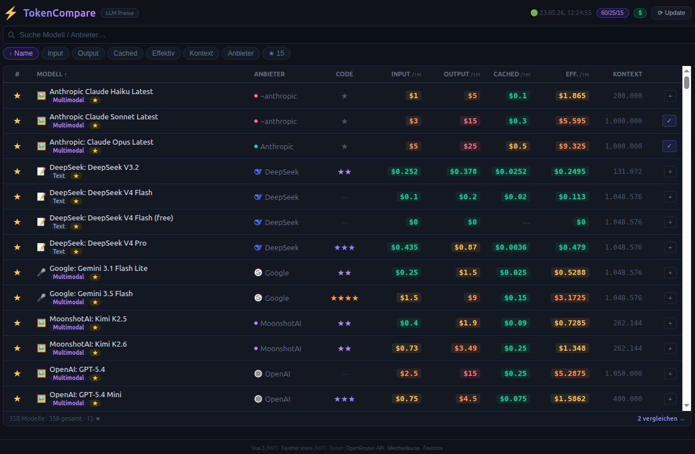

# ⚡ TokenCompare

**Live LLM-Tokenpreise vergleichen** – Eine blitzschnelle Single-Page-Anwendung, die Modelle und Preise von der [OpenRouter API](https://openrouter.ai/) in einer sortierbaren, durchsuchbaren Tabelle darstellt.



## Features

- **Live-Daten** von OpenRouter (350+ Modelle) mit einem Klick aktualisierbar
- **Sortierbare Tabelle** nach Name, Anbieter, Input/Output/Cached/Effektiv-Preis, Kontext, Code-Rating
- **Suche** über Modellname, ID oder Anbieter
- **Favoriten** – Sterne-Markierung, persistent in `localStorage`, Favoriten immer oben
- **Favoriten-Filter** – nur Favoriten anzeigen
- **Code-Rating (0–5★)** – Heuristische Bewertung der Coding-Eignung aus Name und Beschreibung
- **Detail-Modal** – Klick auf ein Modell zeigt Anbieter, Preise, Kontext, Architektur, Beschreibung, Coding-Rating
- **Compare-Modal** – Bis zu 5 Modelle side-by-side vergleichen; günstigster Preis grün markiert
- **Effektiv-Preis** – Gewichteter Mischpreis (Chat 70/30 oder Cache 60/25/15), umschaltbar
- **Währungsumschaltung** USD/EUR mit Live-Wechselkurs
- **Responsive Design** – Mobilansicht blendet Anbieter-, Cached- und Kontext-Spalten aus
- **Dark Theme** – Augenschonendes Farbschema

## Quick Start

```bash
git clone https://github.com/benutzer/TokenCompare.git
cd TokenCompare
./start.sh
# → http://localhost:8080
```

Oder mit einem beliebigen Static-Server:

```bash
python3 -m http.server 8080
```

Keine Build-Tools, kein `npm install` – öffnen und loslegen.

## Technologie-Stack

| Technologie | Zweck | Lizenz |
|---|---|---|
| [Vue 3](https://vuejs.org/) (via CDN) | Reaktivität, Templates, Composition API | MIT |
| [Feather Icons](https://feathericons.com/) | Such-Symbol | MIT |
| [OpenRouter API](https://openrouter.ai/) | Modell- und Preisdaten | – |
| [open.er-api.com](https://open.er-api.com/) | EUR/USD-Wechselkurs | – |
| [Google Favicons](https://www.google.com/s2/favicons) | Provider-Favicons | – |

## Projektstruktur

```
TokenCompare/
├── index.html      # Vue 3 Template + HTML-Struktur (242 Zeilen)
├── style.css       # Dark-Theme-Styling, responsiv (595 Zeilen)
├── app.js          # Vue Composition API – gesamte Anwendungslogik (290 Zeilen)
├── start.sh        # Lokaler Entwicklungsserver
├── README.md       # Diese Datei
└── documentation.md# Detaillierte Architekturdokumentation
```

## Datenmodell (OpenRouter API)

Relevante API-Felder:

| Feld | Beschreibung |
|---|---|
| `id` | Eindeutige ID, z. B. `openai/gpt-4o` |
| `name` | Anzeigename (`"Anbieter: Modellname"`) |
| `pricing` | Objekt mit `prompt`, `completion`, `input_cache_read` (per Token) |
| `context_length` | Kontextfenster in Tokens |
| `architecture.modality` | Modalität (z. B. `"text+image"`) |
| `top_provider.max_completion_tokens` | Maximale Output-Tokens |

Alle Preise werden von Per-Token-Werten auf **/1M Tokens** umgerechnet (`parseFloat` × 1.000.000).

## Lizenz

Dieses Projekt ist unter der [MIT-Lizenz](LICENSE) lizenziert.

## Danksagungen

- [OpenRouter](https://openrouter.ai/) für die kostenlose API
- Dem Vue 3-Team für das großartige Framework
- [Feather](https://feathericons.com/) für die schlanken Icons
